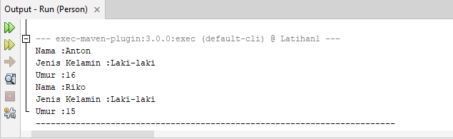

# Praktikum2

1. Mendeklarasikan class person dengan atribut Nama, Jenis Kelamin dan Umur
dilengkapi dengan access modifier

2. Membuat dua buah objek dari class person bernama Anton dan Riko dan
memanggil method setter dan getter

Tampilan hasil akhirnya

